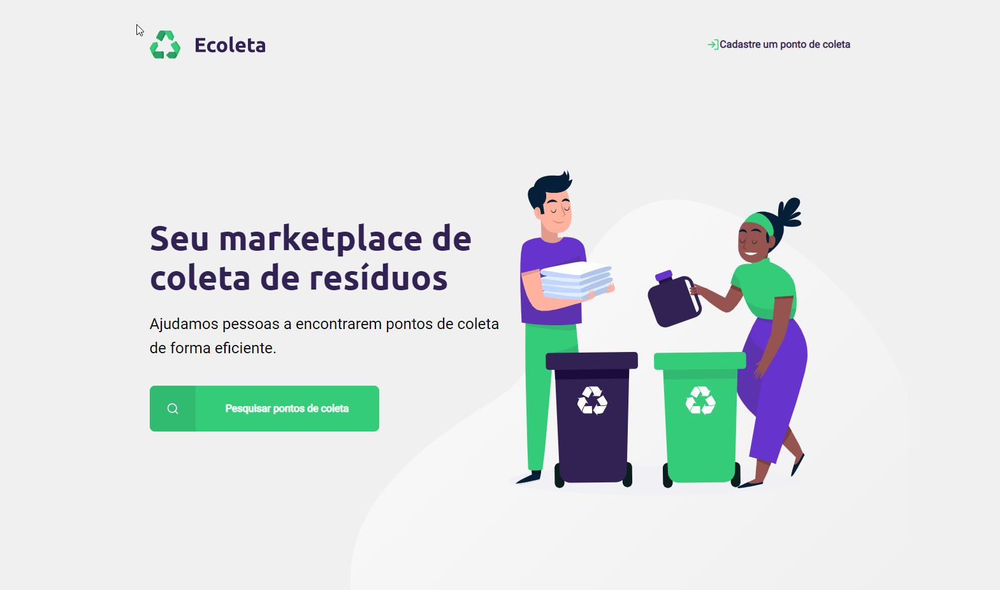
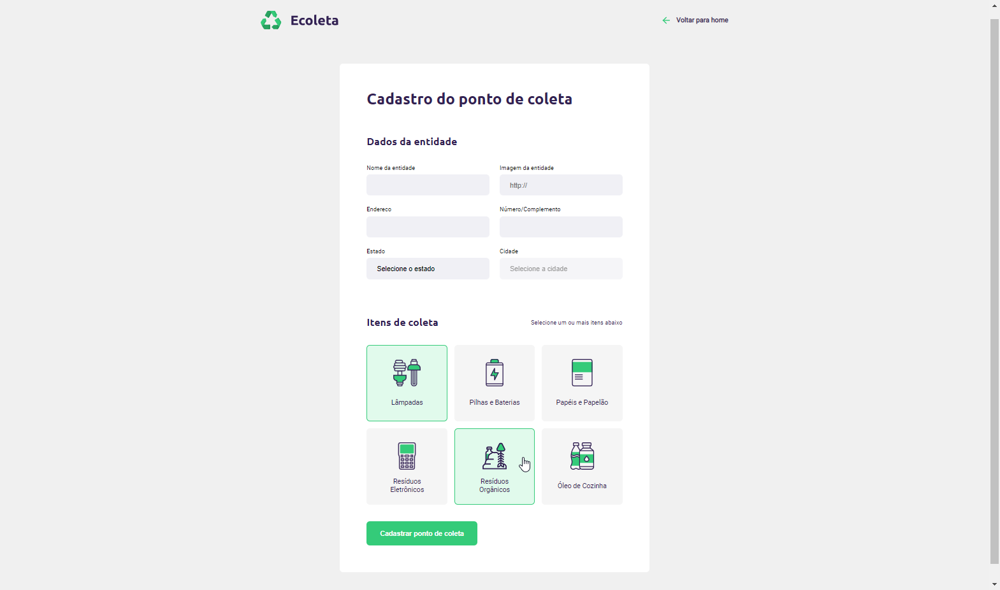
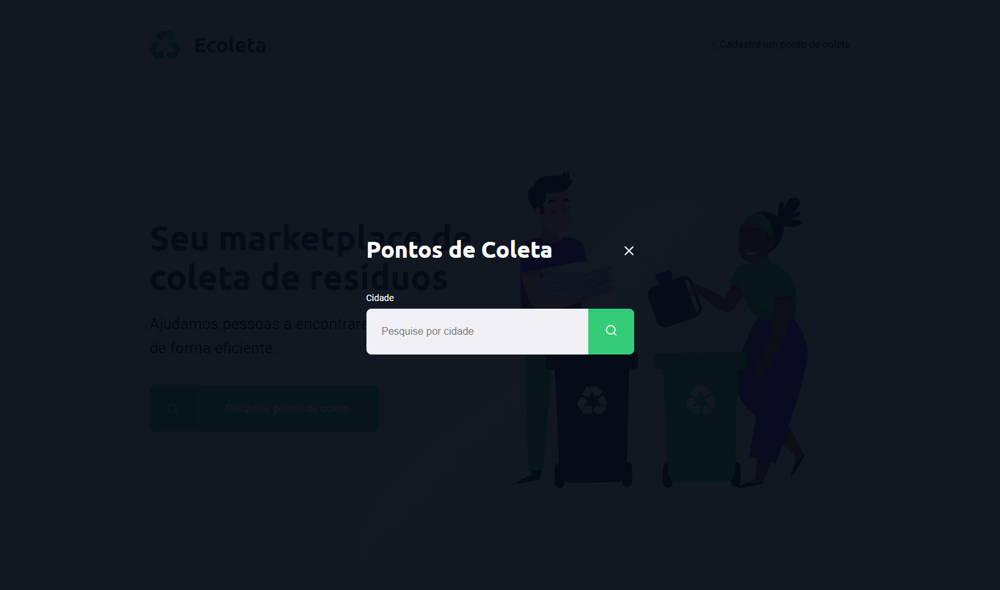
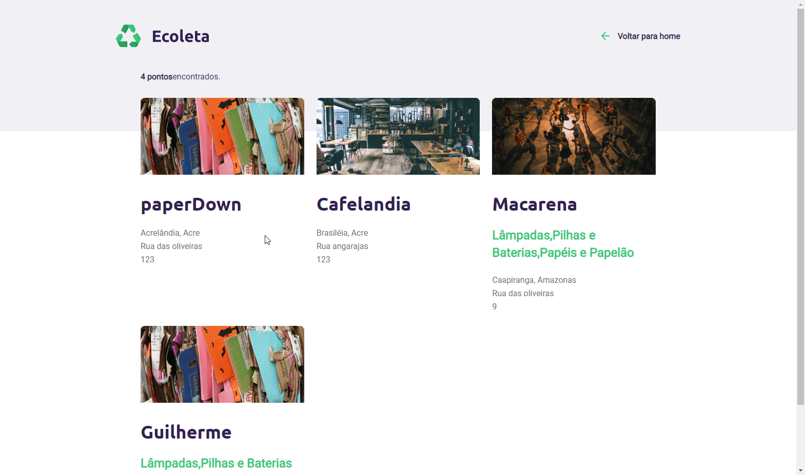

# Projeto eColeta
Projeto completo Node.js de um aplicativo de cadastro e consulta de pontos de reciclagem. Projeto trabalhado na semana de desenvolvimento "Next Level Week" (https://rocketseat.com.br/)

## O que é?
Projeto completo de cadastro e busca de pontos de coleta por cidade. 

#### Página Principal

#### Cadastro de Pontos de Coleta

#### Página de Busca

#### Resultados da pesquisa

## Por que utilizar?
Além do projeto inicial estamos desenvolvendo melhorias e complementos.
Muitos comentários explicando a utilização.
Boa fonte de estudo das tecnologias:
1. Html5
2. CSS
3. Javascript (front-end e back-end)
4. Node.js
5. SQLite 3
 
 
## Como utilizar
Recomendação: Utilizar o vsCode.

1. Baixar o projeto
2. No terminal do vsCode utilizar o comando do npm: npm start (Favor validar e informar quaisquer dificuldades)
